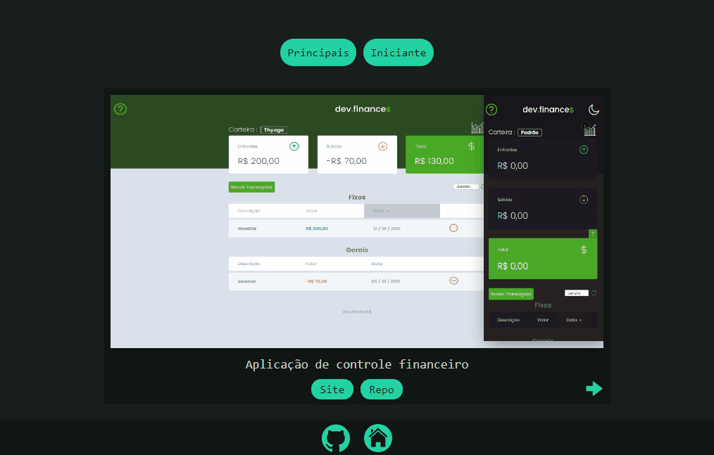
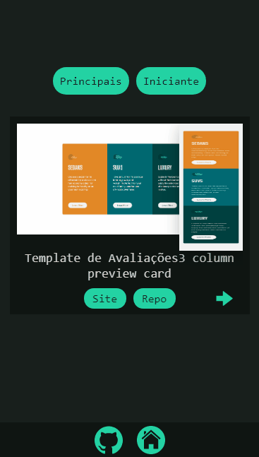

<h1 align="center">
      <a href="#" alt="Templates Práticos"> Templates Práticos </a>
</h1>

<h3 align="center">
   Um repositório com o intuito de aprender utilizando templates prontos.
</h3>

<p align="center">
  

  
  
  <a href="https://github.com/Pluto-ty/README/commits/master">
    
  </a>
    
   
   <a href="https://github.com/Pluto-ty/Praticando-templates/stargazers">
    
   </a>
  
 
</p>

<h4 align="center">
	🚧 Em andamento 🚧
</h4>

<p align="center">
 <a href="#---sobre-o-repositório-">Sobre o projeto</a> •
 <a href="#--features"> Recursos </a> •
 <a href="#--como-executar-o-projeto-">Como executar o projeto</a> •
 <a href="#--Contributing"> Contribuição</a> •  
 <a href="#--font"> Fontes </a> •  
 <a href="#-autor">Autor</a> •
 <a href="#-licenca">Licença</a>
</p>

---

<h2 id="---sobre-o-repositório-"> 💻  Sobre o repositório </h2>

Utilizando templates prontos para reforçar conhecimentos já adquiridos e aprender outros, temos no momento apenas templates na categoria iniciante utilizando Html e Css, porém com planos de adicionar templetes de nível intermediário e avançado. Cada template vai ter sua autor ou fonte em seu respectivo readme e teremos uma lista geral das fontes dos templates no final deste readme.

---

<h2 id="--features"> Recursos </h2>

-  Templates separados por nível. (Apenas iniciante no momento.)
   -  <a href="./iniciante"> Iniciante </a>
-  Cada template separado com seu próprio readme.

---

<h3 id="screenshot" align="center"> Screenshot </h3>
<div align="center">


</div>
</br>

---

<h2 id="--como-executar-o-projeto-"> 🚀 Como executar o projeto </h2>

Este projeto ainda não tem uma página principal para navegar entre os templates. Clone ele se quiser ter os templates na sua maquina.

### Pré-requisitos

Antes de começar, você vai precisar ter instalado em sua máquina as seguintes ferramentas:
[Git](https://git-scm.com) e um bom editor para trabalhar com o código como [VSCode](https://code.visualstudio.com/)

1. Faça clone do projeto:

```bash
$ git clone https://github.com/Pluto-ty/Maratona-Discover.git

```

2. Abra com o editor de escolha e modifique,brinque a vontade.

---

<h2 id="--Contributing"> 🤝 Contribuindo </h2>

Este projeto é para fins de estudo, então me envie um e-mail me contando o que você está fazendo e por que está fazendo, me ensine o que você sabe

Todos os tipos de contribuições são muito bem-vindos e apreciados!

⭐️ Iniciar o projeto
</br>
🐛 Encontrar e relatar problemas
</br>
📥 Envie PRs para ajudar a resolver problemas ou adicionar recursos

---

<h2 id="--font"> Fontes </h2>

-  <a href="https://www.frontendmentor.io"> Frontend Mentor </a>

---

<h2 id="-autor">Autor</h2>

<a href="https://github.com/Pluto-ty">
 
</br>
<p> Thyago Araujo <p>
</a>

[](https://www.linkedin.com/in/thyago-araujo-m/)
[](mailto:thyagoaraujomotta@gmail.com)

---

<h2 id="-licenca"> 📝 Licença </h2>

Este projeto esta sobe a licença [MIT](./LICENSE.md).

Feito com ❤️ por Thyago Araujo 👋🏽 [Entre em contato!](https://www.linkedin.com/in/thyago-araujo-m/)

---
