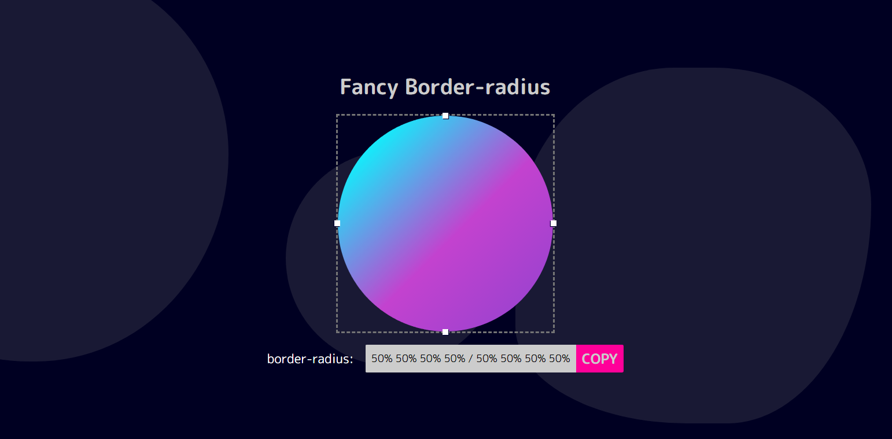

<h2> Tabela de conteúdo </h2>

-  [Visão Geral](#visão-geral)
   -  [Desafio](#desafio)
   -  [Screenshot](#screenshot)
   -  [Links](#links)
-  [Meu processo](#meu-processo)
   -  [Construído com](#build-with)
   -  [O que aprendi](#o-que-aprendi)
-  [Autor](#autor)

<h2 id="visão-geral" align="center"> Visão Geral </h2>

---

 
<h3 id="desafio" align="center">O desafio </h3>
 
<h3>Pré-visualizador de Border-radius</h3>

Nível: 1-iniciante

A propriedade border-radius pode ter vários valores alterados. Visualize a aparência da forma ao alterar esses valores.

User Story:

-  [x] O usuário pode ver uma caixa que tem uma propriedade `border-radius` aplicada a ela.
-  [x] O usuário pode alterar os 4 valores `border-radius` que são aplicados à caixa (superior esquerdo, superior direito, inferior esquerdo, inferior direito).
-  [x] O usuário pode copiar o CSS resultante para a área de transferência.

<h3 id="screenshot" align="center"> Screenshot </h3>

 
 

<h3 id="links" align="center"> Links </h3>

-  Veja Funcionand: [Abrir Página](https://thyagoaraujom.github.io/Praticando-templates/iniciante/Border-radius-Previewer/index.html)

-  Origem do Desafio: [Origem do Template](https://github.com/florinpop17/app-ideas)

 

<h2 id="meu-processo" align="center"> Meu processo </h2>

---

 
<h3 id="build-with" align="center"> Contruido com: </h3>

-  Html
-  Css (BEM)
-  Javascript ( Criar verificação dos números e convertelos para decimais)

<h3 id="o-que-aprendi" align="center"> O que usei e aprendi: </h3>
 

Neste desafio utilizei animações e flex-box para alinhar os elementos, para o javascript utilizei inputs range para o usuário conseguir modificar o border-radius com uma função que vigiava as ações de mouse em cima dos inputs e quando movidos atualizavam em tempo real os valores do border-radius da caixa e do texto abaixo. Para o copy utilizei a função pronta do javascript "clipboard.writeText()". O que aprendi nesse desafio foi que dá para fazer bastante coisa com border-radius como para ícones de perfil e animações como as de fundo.

---

<h2 id="autor">Autor</h2>

<a href="https://github.com/thyagoaraujom">
 
 

 Thyago Araujo 

</a>

