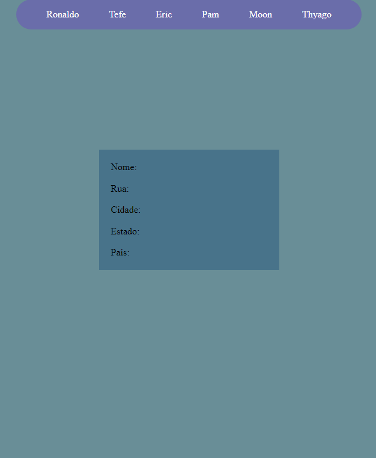

<h2> Tabela de conteúdo </h2>

-  [Visão Geral](#visão-geral)
   -  [Desafio](#desafio)
   -  [Screenshot](#screenshot)
   -  [Links](#links)
-  [Meu processo](#meu-processo)
   -  [Construído com](#build-with)
   -  [O que aprendi](#o-que-aprendi)
-  [Autor](#autor)

<h2 id="visão-geral" align="center"> Visão Geral </h2>

---

 
<h3 id="desafio" align="center">O desafio </h3>
 
<h3>Causa e Efeito</h3>

Nível: 1-iniciante

Um padrão comum de interface com o usuário é resumir os dados em uma seção de uma página que consiste em algum tipo de lista (como texto, imagens ou ícones) que descreve ou categoriza um conjunto de dados. Quando um item da lista é clicado, os dados detalhados por trás dele são exibidos em um painel adjacente na página.

Por exemplo, em um site de imobiliária, clicar em um endereço em uma lista de propriedades à venda exibe os detalhes sobre a propriedade em outra parte da página.

Este desafio requer que o desenvolvedor que o está implementando siga estas restrições:

Use apenas HTML / CSS / Javascript nativo em sua primeira versão deste aplicativo
Você pode usar outros pacotes ou bibliotecas ao implementar versões subsequentes.

<h4>User Story:</h4>

[x] O usuário pode ver uma lista de nomes de pessoas organizados em um painel de resumo na página.
[x] O usuário pode clicar em um nome na lista para atualizar um painel adjacente na página com o nome, endereço entre outros dados de sua escolha.
[x] O usuário pode clicar em outro nome na lista para atualizar o painel de detalhes com as informações desse indivíduo.

<h4> Recursos bônus </h4>

[x] O usuário pode ver o nome da pessoa no painel de resumo destacado quando o cursor passa sobre ele.
[x] O usuário pode ver o nome da pessoa no painel de resumo destacado usando um efeito de seleção (cor, tamanho, etc.) quando clicado. Este é um efeito diferente do efeito de foco
[x]O usuário pode ver o efeito de seleção removido de um nome na lista de resumo quando um novo nome é clicado.

<h3 id="screenshot" align="center"> Screenshot </h3>

 
 

<h3 id="links" align="center"> Links </h3>

-  Veja Funcionand: [Abrir Página](https://thyagoaraujom.github.io/Praticando-templates/iniciante/CauseEffect/index.html)

-  Origem do Desafio: [Origem do Template](https://github.com/florinpop17/app-ideas)

 

<h2 id="meu-processo" align="center"> Meu processo </h2>

---

 
<h3 id="build-with" align="center"> Contruido com: </h3>

-  Html
-  Css (BEM)
-  Javascript ( Criar toda a aplicação para a calculadora)

<h3 id="o-que-aprendi" align="center"> O que usei e aprendi: </h3>
 

Neste desafio utilizei o básico de css só para a visualização da aplicação. O javascript para as funções.

---

<h2 id="autor">Autor</h2>

<a href="https://github.com/thyagoaraujom">
 
 

 Thyago Araujo 

</a>

