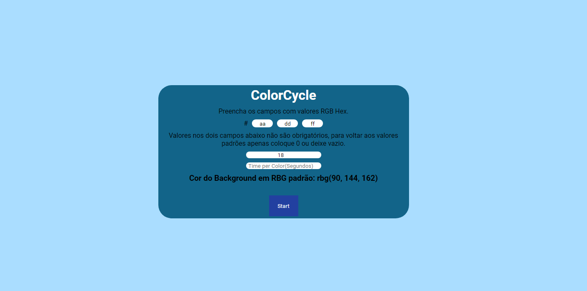

<h2> Tabela de conteúdo </h2>

-  [Visão Geral](#visão-geral)
   -  [Desafio](#desafio)
   -  [Screenshot](#screenshot)
   -  [Links](#links)
-  [Meu processo](#meu-processo)
   -  [Construído com](#build-with)
   -  [O que aprendi](#o-que-aprendi)
-  [Autor](#autor)

<h2 id="visão-geral" align="center"> Visão Geral </h2>

---

 
<h3 id="desafio" align="center">O desafio </h3>
 
<h3>Ciclo de cores</h3>

** Nível: ** 1-Iniciante

O uso de cores desempenha um papel importante na interface do usuário de um aplicativo e
Experiência do usuário (UI / UX). ColorCycle busca ajudar o WebDev a entender melhor
Cores RBG fazendo pequenas alterações em uma caixa colorida ao longo do tempo.

Este aplicativo desenha uma caixa preenchida com uma cor especificada pelo usuário e faz pequenas alterações
ao longo do tempo, também com base na entrada do usuário.

## Histórias de usuários

-  [x] O usuário pode especificar uma cor de preenchimento inicial como um padrão hexadecimal de seis
       Código de cores CSS em três componentes individuais de dois dígitos cada - vermelho,
       azul e verde
-  [x] O usuário pode especificar um valor de incremento para cada componente de cor que
       ser adicionado a esse componente a cada 0,25 segundo
-  [x] O usuário pode ver a caixa que contém a mudança de cor de preenchimento a cada 0,25 segundos
-  [x] O usuário só pode alterar os componentes de cor e seus incrementos quando
       o aplicativo está parado
-  [x] O usuário pode iniciar e parar a operação de preenchimento usando um botão cujo nome
       muda para 'Iniciar' quando parado e 'Parar' quando iniciado
-  [x] O usuário receberá um aviso se algo diferente de dígitos hexadecimais
       são inseridos para os componentes de cor

## Recursos bônus

-  [x] O usuário pode alterar o intervalo de tempo entre as mudanças de cor
-  [] O usuário pode especificar o formato de codificação de cores usado de RGB para outro formato como HS

<h3 id="screenshot" align="center"> Screenshot </h3>

 
 

<h3 id="links" align="center"> Links </h3>

-  Veja Funcionand: [Abrir Página](https://thyagoaraujom.github.io/Praticando-templates/iniciante/ColorCycle/index.html)

-  Origem do Desafio: [Origem do Template](https://github.com/florinpop17/app-ideas)

 

<h2 id="meu-processo" align="center"> Meu processo </h2>

---

 
<h3 id="build-with" align="center"> Contruido com: </h3>

-  Html
-  Css (BEM)
-  Javascript

<h3 id="o-que-aprendi" align="center"> Como foi feito: </h3>
 

Neste desafio utilizei o básico de css só para a visualização da aplicação. O javascript para criar o ciclo de cores, usei um total de 5 funções, a principal primeiro verifica se o valor é mesmo um rgc hexadecimal, com isso ele converte para rgb padrão para conseguir fazer as somas de valores no ciclo. Após converter, a função principal chama uma função para iniciar o ciclo que verifica se o usuário especificou os valores para para o tempo de cada intervalo e o valor de acréscimo, ao verificar a função seta um intervalo, após isso podemos apenas mudar os valores ao parar a aplicação.

---

<h2 id="autor">Autor</h2>

<a href="https://github.com/thyagoaraujom">
 
 

 Thyago Araujo 

</a>

