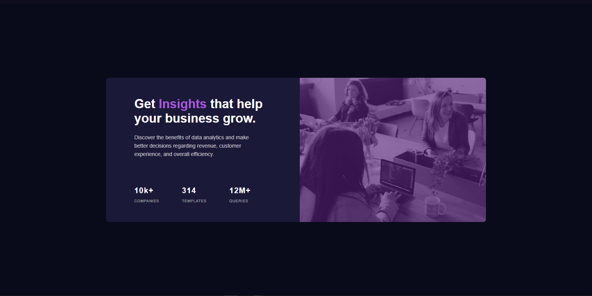
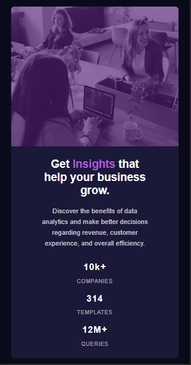

<h2> Tabela de conteúdo </h2>

-  [Visão Geral](#visão-geral)
   -  [Desafio](#desafio)
   -  [Screenshot](#screenshot)
   -  [Links](#links)
-  [Meu processo](#meu-processo)
   -  [Construído com](#build-with)
   -  [O que aprendi](#o-que-aprendi)
-  [Autor](#autor)

<h2 id="visão-geral" align="center"> Visão Geral </h2>

---

 
<h3 id="desafio" align="center">O desafio </h3>
 

O desafio é criar um compoente de cartão e deixar o mais próximo do design possível. Os usuários devem conseguir ver o layout, independente do tamanho da tela ou dispositivo.

<h3 id="screenshot" align="center"> Screenshot </h3>

 
 

<h3 id="links" align="center"> Links </h3>

-  Veja Funcionand: [Abrir Página](https://pluto-ty.github.io/Praticando-templates/iniciante/Stats%20preview%20card%20component/index.html)

-  Origem do Template: [Origem do Template](https://www.frontendmentor.io/challenges/stats-preview-card-component-8JqbgoU62)

 

<h2 id="meu-processo" align="center"> Meu processo </h2>

---

 
<h3 id="build-with" align="center"> Contruido com: </h3>

-  Html
-  Css ( Flexbox e BEM)
-  Mobile-first workflow

<h3 id="o-que-aprendi" align="center"> O que usei e aprendi: </h3>
 

Neste desafio utilizei flexbox para todo o layout e tentei usar pela primeira vez a técnica mobile-first estilizando todo o layout para a versão mobile e depois utilizando media queries para estilizar o layout para computadores. A minha única dúvida era como colocar o efeito de cor em cima da imagem e descobri que era usando o pseudo-elemento :after dentro da div que envolvia a imagem.

---

<h2 id="autor">Autor</h2>

<a href="https://github.com/Pluto-ty">
 
 

 Thyago Araujo 

</a>

